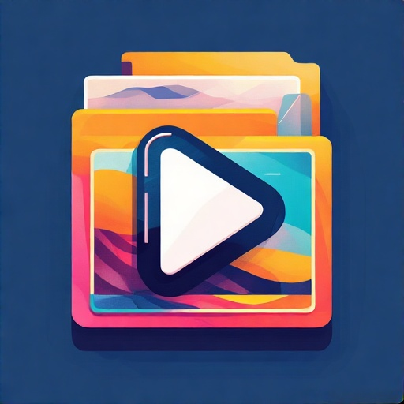
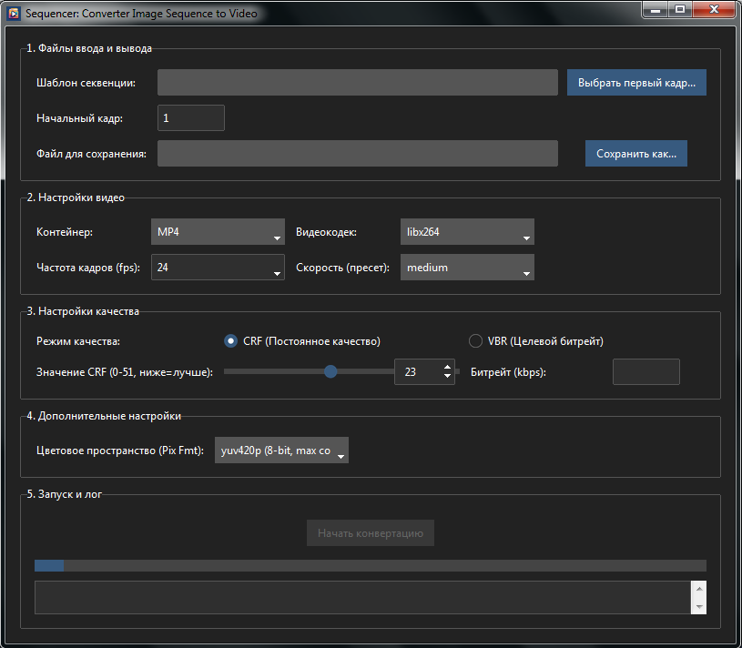

 
 

 
<h1 align="center">Image Sequence to Video Converter</h1> 

 <strong>Стильная и мощная GUI-оболочка для <code>ffmpeg</code>, созданная для быстрой и удобной конвертации секвенций изображений в видео.</strong> 
 
     
 

  

## ✨ Ключевые возможности

-   **🎨 Удобный GUI-интерфейс**: Элегантный и приятный для глаз интерфейс, созданный с помощью  `ttkbootstrap`. Достаточно быстро и удобно работать, не нужно вводить команды и постоянно заглядывать в документацию `FFmpeg`.
-   **🔍 Автоматическое определение секвенции**: Просто выберите первый кадр (желательный формат - `Frame.0001.png` или `Frame_0001.png`), и приложение само определит шаблон (например, `frame.%04d.png`) и начальный номер кадра.
-   **⚙️ Обширные настройки конвертации**:
    -   **Контейнеры**: MP4, WebM, MOV, AVI.
    -   **Видеокодеки**:  `libx264`,  `libx265`,  `libvpx-vp9`,  `prores_ks`  и другие (список динамически меняется в зависимости от контейнера).
    -   **Режимы качества**: Выбор между CRF (постоянное качество) и VBR (целевой битрейт).
    -   **Пресеты скорости**: От  `ultrafast`  до  `veryslow`  для контроля соотношения скорость/качество.
    -   **Цветовое пространство**: Поддержка  `yuv420p`  (8-bit),  `yuv422p`,  `yuv444p`  и  `yuv420p10le`  (10-bit).
-   **🚀 Неблокирующий интерфейс**: Процесс конвертации запускается в отдельном потоке, поэтому интерфейс остается отзывчивым во время работы.
-   **📝 Лог в реальном времени**: Отслеживайте процесс конвертации и диагностируйте ошибки с помощью вывода  `ffmpeg`  прямо в окне приложения (на экранах с низким разрешением, возможно, понадобится немного «растянуть» окно, чтобы блок вывода был виден).
-   **✔️ Проверка наличия  `ffmpeg`**: Приложение автоматически проверяет, доступен ли  `ffmpeg.exe`  в системе или расположен рядом с исполняемым файлом утилиты.

## 🚀 Установка и запуск

Приложение готово к запуску и доступно для скачивания в разделе [Releases](https://github.com/rytp-tv/Sequencer/releases). Работа была протестирована на Windows 7 SP1.

## ❓Как использовать

1.  **Выбрать первый кадр**: Нажмите на кнопку  `Выбрать первый кадр...`  и укажите первый файл вашей секвенции (например,  `render_v01.0001.png`). Поле "Шаблон секвенции" заполнится автоматически.
2.  **Указать путь сохранения**: Нажмите  `Сохранить как...`  и выберите, куда сохранить итоговое видео.
3.  **Настроить параметры**: Выберите желаемый контейнер, кодек, частоту кадров и настройки качества. Желательно, чтобы параметры соответствовали той же частоте кадров, с которой вы создавали последовательность (при экспорте из **Blender** / **Maya** / **Cinema 4D** / **Photoshop** / **Vegas Pro** и т.п.)
4.  **Начать конвертацию**: Нажмите зеленую кнопку  **`НАЧАТЬ КОНВЕРТАЦИЮ`**.
5.  **Отслеживать процесс**: Наблюдайте за прогрессом в лог-панели внизу окна. По завершении в строке состояния появится уведомление, а видеофайл сохранится в указанной вами директории.

## 💻 Использованные библиотеки и утилиты: 

-   **Python 3**
-   **Tkinter / ttkbootstrap**
-   **FFmpeg**

## ✏️ Вклад в проект

Будем рады вашим предложениям и отчётам об ошибках. Если у вас есть идеи по улучшению или добавлению новых функций, пожалуйста, создайте  [Issue](https://github.com/rytp-tv/Sequencer/issues).

## 📄 Лицензия

Этот проект распространяется под лицензией MIT. Подробности смотрите в файле  `LICENSE`.
